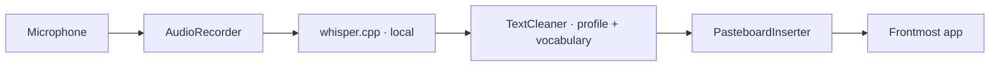

<div align="center">

# Murmur

[](LICENSE)
[](docs/install.md)
[](https://github.com/roshanshah11/murmur/stargazers)
[](https://github.com/roshanshah11/murmur/actions/workflows/ci.yml)
[](https://github.com/roshanshah11/murmur/releases/latest)
[](https://github.com/roshanshah11/murmur/releases)
[](https://github.com/sponsors/roshanshah11)

**Local-first Mac dictation. Double-tap `fn`, speak, paste.**

No cloud. No account. No telemetry.


More screenshots: [docs/ →](docs/)

```bash
brew install --cask roshanshah11/murmur/murmur
```

[Install](#install) · [Quick start](#quick-start) · [Docs](docs/) · [Releases](https://github.com/roshanshah11/murmur/releases)

</div>

---

## Install

**Homebrew (recommended)** — handles macOS first-launch trust for you:

```bash
brew install --cask roshanshah11/murmur/murmur
```

**Direct DMG** — manual download:

```
https://github.com/roshanshah11/murmur/releases/latest/download/Murmur.dmg
```

Drag **Murmur.app** into `/Applications`. On first launch macOS shows "cannot verify the developer" (1.0.x is signed but not yet Apple-notarised — notarisation lands in 1.1.x). To bypass once: right-click `Murmur.app` → **Open** → click **Open** in the dialog. macOS remembers; future launches are normal.

| Requirement | Minimum |
|---|---|
| macOS | 13 Ventura |
| Architecture | Apple Silicon or Intel x86_64 |
| Disk | ~500 MB app + 75 MB–3 GB per model |
| RAM | 4 GB free (8 GB for the large model) |
| Mic | Any input device macOS recognises |

Full matrix and Gatekeeper recovery steps: [docs/install.md](docs/install.md).

## Quick start

1. **Disable Apple Dictation.** System Settings → Keyboard → Dictation → off. Apple's dictation listens for the same `fn`+`fn` chord and will fight Murmur for the key.
2. **Grant Microphone and Accessibility.** Launch Murmur, click **Allow** when macOS asks, then toggle Murmur on under System Settings → Privacy & Security → Accessibility. The first-run window deep-links both panes.
3. **Click any text field.** Mail, Slack, VS Code, the URL bar — anywhere a cursor blinks.
4. **Double-tap `fn`. Speak. Done.** The overlay near the notch confirms recording. Stop talking (or double-tap `fn` again) and the cleaned transcript pastes itself.

Full walkthrough: [docs/first-run.md](docs/first-run.md).

## Features

| | |
|---|---|
| **Settings** | Seven tabs: General, Recording, Vocabulary, Prompts, Models, Updates, About. |
| **History** | Opt-in. Off by default. A separate window — not a Settings tab. Browse, search, and export past transcripts. |
| **Vocabulary** | Teach Whisper your names, acronyms, and jargon. JSON import/export. |
| **Prompts** | Deterministic cleanup profiles — Raw, Casual, Formal, Code. Switch per-recording or as a default. |
| **Models** | Whisper.cpp models from tiny to large-v3. SHA-verified downloads with progress UI. |
| **Updates** | Sparkle 2 with EdDSA-signed appcast. One click to update; no background phone-home. |

## Privacy

> - Zero network during transcription.
> - No telemetry, ever.
> - Audio temp deleted on success; transcripts never logged.

Full promise: [PRIVACY.md](PRIVACY.md).

## How it works



A global hotkey monitor watches for `fn`+`fn`. Audio captures locally. Whisper.cpp transcribes on-device — Metal-accelerated on Apple Silicon, CPU on Intel. A deterministic cleanup pass strips filler and applies the active prompt profile. The result is pasted into whatever app held the cursor when you started.

Deeper dive: [docs/architecture.md](docs/architecture.md).

## Configuration

Murmur stores everything under Apple-conventional paths:

```
~/Library/Application Support/Murmur/
  ├── config.json          # Settings (mirrored to UserDefaults)
  ├── vocabulary.json      # Custom terminology
  ├── history.sqlite       # Only if History is enabled
  └── Models/              # Downloaded Whisper models
```

Every setting documented in [docs/settings.md](docs/settings.md).

## CLI mode

Headless transcription, useful for scripting and CI:

```
/Applications/Murmur.app/Contents/MacOS/Murmur --transcribe-only path/to/audio.wav
```

Prints the cleaned transcript to stdout and exits. See `--help` for `--record-once` and other flags.

## Roadmap

Tracked in [GitHub Milestones](https://github.com/roshanshah11/murmur/milestones).

**Not planned, ever:**

- Cloud transcription
- Mobile / iOS / iPad
- Mac App Store distribution
- Team accounts / sync
- Telemetry
- Real-time streaming partials

If you want any of those, Murmur isn't the project for you — and that's fine.

## Build from source

<details>
<summary>Clone, bootstrap, build</summary>

```
git clone https://github.com/roshanshah11/murmur
cd murmur
bash app/Scripts/bootstrap_whisper_cpp.sh
bash app/Scripts/build_app.sh
open app/build/Murmur.app
```

Toolchain: Xcode 15.4+, Swift 5.10, Homebrew, `cmake`. Signing and notarisation scripts live in `app/Scripts/`. Full notes in [docs/development.md](docs/development.md).

</details>

## Contributing

Bug reports, fixes, and small features welcome. Larger changes — please open an issue first so we can agree on scope.

- [CONTRIBUTING.md](CONTRIBUTING.md) — workflow, style, commit format, PR checklist.
- [CODE_OF_CONDUCT.md](CODE_OF_CONDUCT.md) — Contributor Covenant 2.1.
- [SECURITY.md](SECURITY.md) — how to report a vulnerability privately.
- [CHANGELOG.md](CHANGELOG.md) — release notes.

## License and credits

[MIT](LICENSE). Use it, fork it, ship it, modify it.

- Built on [whisper.cpp](https://github.com/ggerganov/whisper.cpp) by Georgi Gerganov.
- Updates powered by [Sparkle 2](https://sparkle-project.org/) by the sparkle-project team.
- Authored by [Roshan Shah](https://github.com/roshanshah11) — [sponsor](https://github.com/sponsors/roshanshah11).
