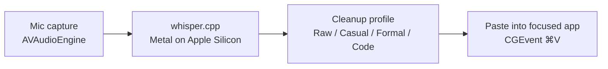

<div align="center">

# Murmur

[](LICENSE)
[](https://github.com/roshanshah11/murmur/actions)
[](https://github.com/roshanshah11/murmur/releases/latest)
[](https://github.com/roshanshah11/murmur/releases)
[](https://github.com/roshanshah11/murmur/stargazers)
[](#install)

**Local-first Mac dictation. Double-tap `fn`, speak, paste.**

No cloud. No account. No telemetry.


```bash
brew install --cask roshanshah11/murmur/murmur
```

[Install](#install) · [Quick start](#quick-start) · [Docs](https://roshanshah11.github.io/murmur/) · [Releases](https://github.com/roshanshah11/murmur/releases)

</div>

---

## Install

The cask is signed, notarized, and stapled. Gatekeeper opens it silently.

```bash
brew install --cask roshanshah11/murmur/murmur
```

Prefer a manual install? Download the latest signed DMG from the [Releases page](https://github.com/roshanshah11/murmur/releases/latest), drag **Murmur.app** into `/Applications`, and launch it from Spotlight.

| Requirement | Minimum |
|---|---|
| macOS | 13 Ventura |
| Architecture | Apple Silicon or Intel x86_64 |
| Disk | ~500 MB app + 75 MB–3 GB per model |
| RAM | 4 GB free (8 GB for the large model) |
| Mic | Any input device macOS recognizes |

Full install matrix and Gatekeeper recovery steps: [docs/install](https://roshanshah11.github.io/murmur/install/).

## Quick start

1. **Disable Apple Dictation.** System Settings → Keyboard → Dictation → off. Apple's dictation listens for the same `fn`+`fn` chord and will fight Murmur for the key.
2. **Grant Microphone and Accessibility.** Launch Murmur, click **Allow** when macOS asks, then toggle Murmur on under System Settings → Privacy & Security → Accessibility. The first-run window deep-links both panes.
3. **Click any text field.** Mail, Slack, VS Code, the URL bar — anywhere a cursor blinks.
4. **Double-tap `fn`. Speak. Done.** The overlay near the notch confirms recording. Stop talking (or double-tap `fn` again) and the cleaned transcript pastes itself.

Full walkthrough: [First run](https://roshanshah11.github.io/murmur/first-run/).

## Features

| | |
|---|---|
| **Settings** | Seven tabs: General, Recording, Models, Vocabulary, Prompts, History, Updates. |
| **History** | Opt-in. Off by default. Browse, search, and export every past transcript when you turn it on. |
| **Vocabulary** | Teach Whisper your names, acronyms, and jargon. JSON import/export. |
| **Prompts** | Deterministic cleanup profiles — Raw, Casual, Formal, Code. Switch per-recording or as a default. |
| **Models** | Whisper.cpp models from tiny to large-v3. SHA-verified downloads with progress UI. |
| **Updates** | Sparkle 2 with EdDSA-signed appcast. One click to update; no background phone-home. |

## Privacy

- No network calls except the Sparkle update check (which you can disable in Settings → Updates).
- No analytics, no telemetry, no crash reporters, no opt-in/opt-out screen — because there's nothing to opt into.
- Audio buffers live in `/tmp` for the seconds it takes to transcribe, then are deleted. Transcripts only persist if you enable History.

Read the full promise: [PRIVACY.md](PRIVACY.md).

## How it works



A global hotkey monitor watches for `fn`+`fn`. Audio captures locally. Whisper.cpp transcribes on-device — Metal-accelerated on Apple Silicon, CPU on Intel. A deterministic cleanup pass strips filler and applies the active prompt profile. The result is pasted into whatever app held the cursor when you started.

Deeper dive: [Architecture](https://roshanshah11.github.io/murmur/architecture/).

## Configuration

Murmur stores everything under Apple-conventional paths:

```
~/Library/Application Support/Murmur/
  ├── config.json          # Settings (mirrored to UserDefaults)
  ├── vocabulary.json      # Custom terminology
  ├── history.sqlite       # Only if History is enabled
  └── Models/              # Downloaded Whisper models
```

Every setting is documented in [Settings](https://roshanshah11.github.io/murmur/settings/).

## CLI mode

Headless transcription, useful for scripting and CI:

```bash
/Applications/Murmur.app/Contents/MacOS/Murmur --transcribe-only path/to/audio.wav
```

Prints the cleaned transcript to stdout and exits. See `--help` for `--record-once` and other flags.

## Roadmap

Tracked in [GitHub Milestones](https://github.com/roshanshah11/murmur/milestones).

**Not planned, ever:**

- Mac App Store distribution (sandboxing breaks Accessibility-driven paste).
- Cloud transcription, accounts, or sync.
- iOS or iPadOS port.
- Any form of telemetry, even opt-in.

If you want any of those, Murmur isn't the project for you — and that's fine.

## Build from source

```bash
git clone https://github.com/roshanshah11/murmur.git
cd murmur
bash app/Scripts/build_app.sh
```

The script bootstraps whisper.cpp, resolves Swift packages, builds a Release `.app`, and drops it in `app/build/`. Drag it to `/Applications` to test the production layout.

<details>
<summary>Development setup, signing, and notarization</summary>

Toolchain: Xcode 15.4+, Swift 5.10, Homebrew, `cmake` (for whisper.cpp). Hot loop:

```bash
cd app
swift build
swift run Murmur --transcribe-only sample.wav
```

Signing and notarization scripts live in `app/Scripts/`:

- `setup_signing.sh` — one-time keychain profile setup.
- `sign_and_notarize.sh` — sign, notarize, and staple a `.app`.
- `package_dmg.sh` — wrap the signed `.app` in a distributable DMG.

Full notes in [docs/development](https://roshanshah11.github.io/murmur/development/).

</details>

## Contributing

Bug reports, fixes, and small features welcome. Larger changes — please open an issue first so we can agree on scope before you write code.

- [CONTRIBUTING.md](CONTRIBUTING.md) — workflow, style, commit format, PR checklist.
- [CODE_OF_CONDUCT.md](CODE_OF_CONDUCT.md) — Contributor Covenant 2.1.
- [SECURITY.md](SECURITY.md) — how to report a vulnerability privately.

## License

[MIT](LICENSE). Use it, fork it, ship it, modify it. Attribution appreciated, not required.

## Credits

- [whisper.cpp](https://github.com/ggerganov/whisper.cpp) by Georgi Gerganov — the engine that makes on-device transcription tractable.
- [Sparkle](https://sparkle-project.org/) — the macOS update framework Murmur uses for signed in-app updates.
- Built by [Roshan Shah](https://github.com/roshanshah11).
