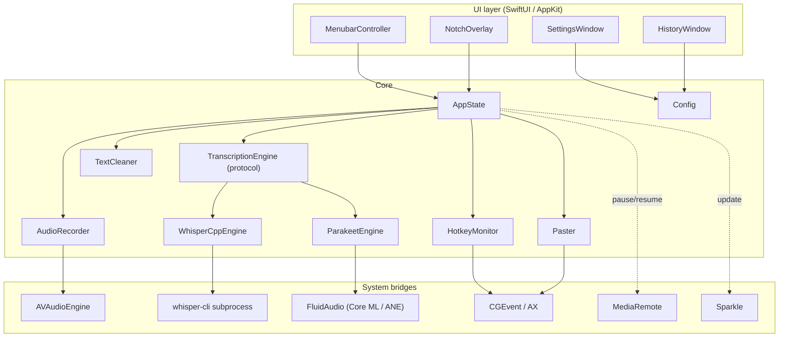
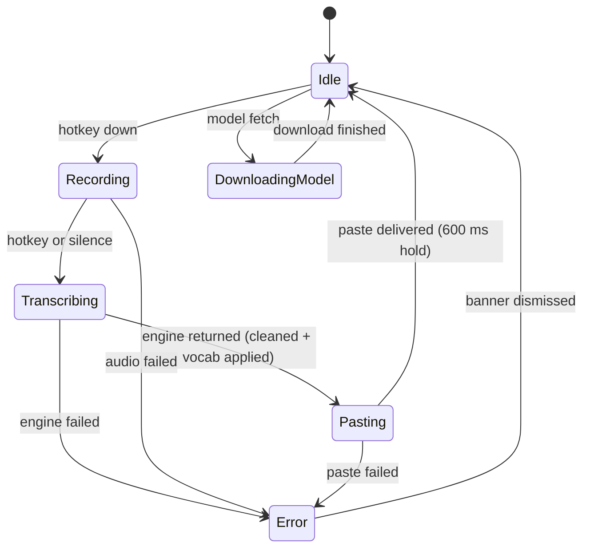

# Architecture

Get oriented in the Murmur codebase: module layout, the transcription-engine
abstraction, state machine, threading model, and where to read first.

For setup instructions go to [Development](development.md).

## Module map



## Transcription engines

Transcription sits behind one protocol so the rest of the pipeline never knows
which backend ran:

```swift
protocol TranscriptionEngine {
    func transcribe(wavURL: URL, language: String?) async throws -> String
    func prepare() async throws        // preload / validate; default no-op
}
```

`TranscriptionEngineFactory.make(config:)` builds the active engine from
`config.transcriptionEngine`. There are two conformers, fundamentally different
in *where* they run:

| Engine | Mechanism | Process | Hardware | Languages |
|---|---|---|---|---|
| `ParakeetEngine` | NVIDIA Parakeet `parakeet-tdt-0.6b-v3` via the **FluidAudio** SDK (Core ML) | **In-process** | Apple Neural Engine | 25 European |
| `WhisperCppEngine` | wraps `WhisperRunner`, which shells out to a bundled **whisper-cli** binary | **Out-of-process** (subprocess) | Metal / CPU | 99 |

- **`ParakeetEngine`** is an `actor`. It loads the FluidAudio `AsrManager` once
  (single-flighted through a cached `Task`, so the launch-time preload and a
  racing first dictation can't double-load) and reuses it for every dictation.
  Models download on demand to FluidAudio's cache
  (`~/Library/Application Support/FluidAudio/Models/`, ~470 MB for v3) and run on
  the ANE. All Core ML / FluidAudio specifics are confined to this file.
- **`WhisperCppEngine`** keeps every subprocess concern — timeout scaling,
  async pipe draining, thread auto-tuning — inside `WhisperRunner`. It exists as
  the fallback for languages Parakeet doesn't cover.

**Default engine is hardware-aware** (`TranscriptionEngineKind.deviceDefault`):
Parakeet on Apple Silicon (where the ANE makes it ~3–6× faster than whisper),
whisper.cpp on Intel (where Core ML has no ANE to fall back on). The user can
override the choice in **Settings → Models**; it persists in `Config`.

Because Parakeet (FluidAudio) requires **macOS 14**, that is Murmur's minimum
deployment target — SwiftPM cannot link a macOS-14 package into a macOS-13 one.

### Async ↔ sync bridge

`AppState.runPipeline` is synchronous and runs on a background `DispatchQueue`,
but the protocol's `transcribe` is `async`. `AsyncBridge.runBlocking` blocks the
current background-queue worker thread on a `Task` until the async engine
returns. This is safe because DispatchQueue worker threads are not Swift
concurrency cooperative threads, so blocking one does not starve the pool. It
must never be called on the main thread.

## State machine

`MurmurState` is the single source of truth for what's happening at any moment.
All UI subscribes to it.



Transitions are explicit; every transition logs its label without the transcript
payload.

## Threading model

| Layer | Thread |
|---|---|
| `MenubarController`, `SettingsWindow`, `NotchOverlay` | Main (UI) |
| `HotkeyMonitor` | Main run loop (CGEventTap requires it) |
| `AudioRecorder` | `AVAudioRecorder`'s own audio thread |
| `AppState.runPipeline` | Background `DispatchQueue` `flowlite.pipeline`, QoS `userInitiated` |
| `WhisperCppEngine` | Subprocess + async pipe-drain handlers off the pipeline thread |
| `ParakeetEngine` | `actor`; Core ML inference on the ANE via FluidAudio |
| `AsyncBridge.runBlocking` | Blocks the pipeline thread until the async engine returns |
| `TextCleaner`, `Vocabulary` substitution | Synchronous on the pipeline thread |
| `Paster` | Main thread (Accessibility + clipboard APIs require it) |
| `Sparkle` | Sparkle-owned background queue |

All cross-thread state flows through `AppState`, which publishes `MurmurState`
changes on the main thread. No view directly touches the recorder or an engine.

## Key file pointers

| Concern | File |
|---|---|
| App entry point + AppDelegate | `app/Sources/Murmur/main.swift` |
| Pipeline coordinator + state machine | `app/Sources/Murmur/AppState.swift` |
| Global hotkey | `app/Sources/Murmur/HotkeyMonitor.swift` |
| Audio capture | `app/Sources/Murmur/AudioRecorder.swift` |
| Engine protocol | `app/Sources/Murmur/Transcription/TranscriptionEngine.swift` |
| Engine factory | `app/Sources/Murmur/Transcription/TranscriptionEngineFactory.swift` |
| Parakeet engine (FluidAudio) | `app/Sources/Murmur/Transcription/ParakeetEngine.swift` |
| whisper.cpp engine | `app/Sources/Murmur/Transcription/WhisperCppEngine.swift` |
| whisper-cli subprocess driver | `app/Sources/Murmur/WhisperRunner.swift` |
| Async→sync bridge | `app/Sources/Murmur/Transcription/AsyncBridge.swift` |
| Parakeet model state (Settings) | `app/Sources/Murmur/Transcription/ParakeetModelManager.swift` |
| Engine-kind enum (persisted) | `app/Sources/Murmur/Transcription/TranscriptionEngineKind.swift` |
| Text cleanup profiles | `app/Sources/Murmur/TextCleaner.swift` |
| Vocabulary | `app/Sources/Murmur/Text/Vocabulary.swift` |
| Paste path | `app/Sources/Murmur/PasteboardInserter.swift` |
| Notch overlay | `app/Sources/Murmur/NotchIndicator.swift` |
| Settings → Models tab | `app/Sources/Murmur/UI/Settings/ModelsTab.swift` |
| GGML (whisper) model manager | `app/Sources/Murmur/Transcription/ModelManager.swift` |
| Config persistence | `app/Sources/Murmur/Config.swift` |
| Sparkle integration | `app/Sources/Murmur/Update/SparkleUpdater.swift` |
| CLI entry points | `app/Sources/Murmur/CLI.swift` |

## How to read the codebase

If you've never opened Murmur before, walk it in this order:

1. `main.swift` — wires up `AppState` and builds the engine via the factory.
2. `AppState.swift` — the state machine + `runPipeline`, the contract every
   other module follows.
3. `HotkeyMonitor.swift` → `AudioRecorder.swift` → `TranscriptionEngine.swift`
   (+ `WhisperCppEngine` / `ParakeetEngine`) — the happy-path dataflow.
4. `TextCleaner.swift` + `Vocabulary.swift` — pure functions, easiest to read.
5. `PasteboardInserter.swift` — the trickiest module; clipboard swap-and-restore.
6. `NotchIndicator.swift` — explains the screen-geometry math.

## Tests

Tests live in `app/Tests/MurmurTests/`. Run with:

```bash
cd app && swift test
```

Engine tests cover the pure pieces (e.g. `ParakeetEngineTests` for the
language-code mapping); the heavy Core ML model load is intentionally NOT
exercised in the unit suite to keep it fast and offline.

## Next

- [Development](development.md) for the build + contribution flow.
- [Models](models.md) for the engine/model choices.
- [Privacy](privacy.md) for the network surface.
