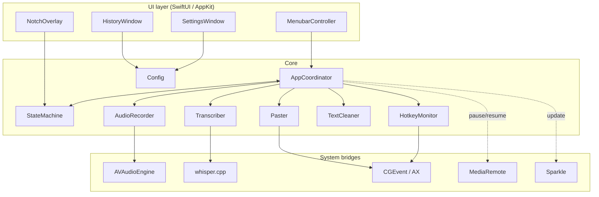
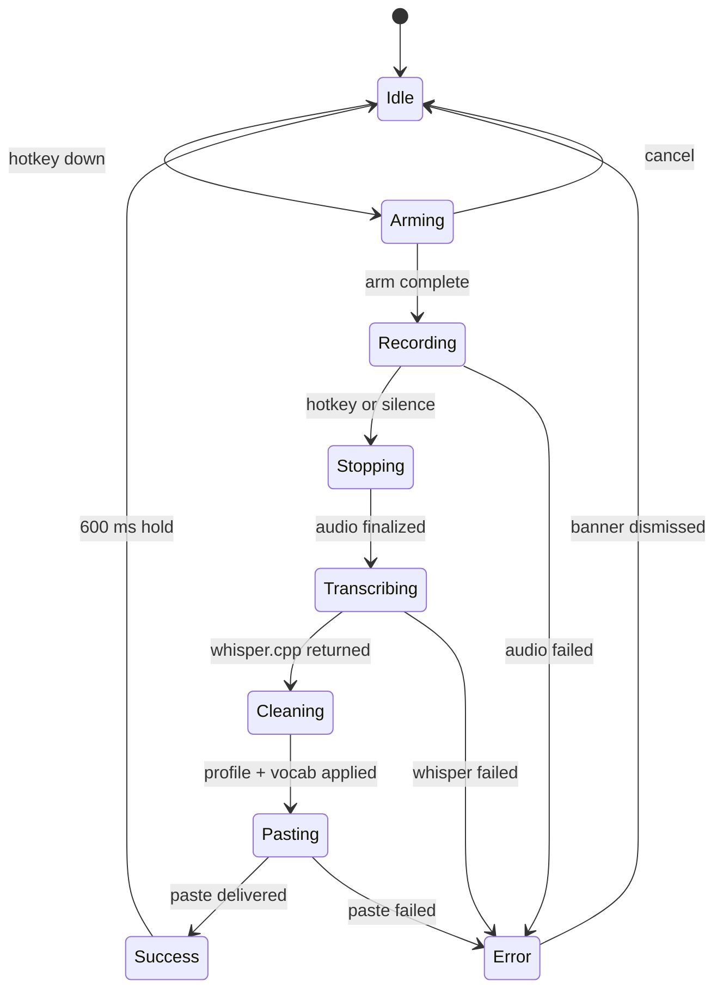

# Architecture

Get oriented in the Murmur codebase: module layout, state machine, threading model, and where to read first.

For setup instructions go to [Development](development.md).

## Module map



## State machine

`MurmurState` is the single source of truth for what's happening at any moment. All UI subscribes to it.



Transitions are explicit; there is no implicit fallthrough. Every transition logs its label without the transcript payload.

## Threading model

| Layer | Thread |
|---|---|
| `MenubarController`, `SettingsWindow`, `NotchOverlay` | Main (UI) |
| `HotkeyMonitor` | Main run loop (CGEventTap requires it) |
| `AudioRecorder` | Dedicated `AVAudioSession` thread, audio render priority |
| `Transcriber` | Background `DispatchQueue` labeled `murmur.transcribe`, QoS `userInitiated` |
| `TextCleaner`, `Vocabulary` substitution | Synchronous on the transcribe queue |
| `Paster` | Main thread (Accessibility + clipboard APIs require it) |
| `Sparkle` | Sparkle-owned background queue |

All cross-thread state flows through the `StateMachine`, which serializes mutations on a private serial queue and publishes via Combine. No view directly touches the recorder or the transcriber.

## Key file pointers

| Concern | File |
|---|---|
| App entry point | `Sources/Murmur/App/MurmurApp.swift` |
| Coordinator | `Sources/Murmur/Core/AppCoordinator.swift` |
| State machine | `Sources/Murmur/Core/StateMachine.swift` |
| Global hotkey | `Sources/Murmur/Input/HotkeyMonitor.swift` |
| Audio capture | `Sources/Murmur/Audio/AudioRecorder.swift` |
| Whisper bridge | `Sources/Murmur/Transcription/Transcriber.swift` |
| whisper.cpp wrapper | `Sources/CWhisper/` |
| Text cleanup profiles | `Sources/Murmur/Text/TextCleaner.swift` |
| Vocabulary | `Sources/Murmur/Text/Vocabulary.swift` |
| Paste path | `Sources/Murmur/Paste/Paster.swift` |
| Notch overlay | `Sources/Murmur/UI/NotchOverlay.swift` |
| Settings window | `Sources/Murmur/UI/Settings/*` |
| History viewer | `Sources/Murmur/UI/History/*` |
| Config persistence | `Sources/Murmur/Config/Config.swift` |
| Model downloader | `Sources/Murmur/Models/ModelDownloader.swift` |
| Sparkle integration | `Sources/Murmur/Updates/UpdaterController.swift` |
| Media remote bridge | `Sources/Murmur/Media/MediaRemoteController.swift` |
| Logging | `Sources/Murmur/Logging/Logger.swift` |
| CLI entry points | `Sources/Murmur/CLI/CLI.swift` |

## How to read the codebase

If you've never opened Murmur before, walk it in this order:

1. `MurmurApp.swift` — wires up `AppCoordinator`.
2. `StateMachine.swift` — the contract every other module follows.
3. `HotkeyMonitor.swift` → `AudioRecorder.swift` → `Transcriber.swift` — the happy-path dataflow.
4. `TextCleaner.swift` + `Vocabulary.swift` — pure functions, easiest to read.
5. `Paster.swift` — the trickiest module; clipboard swap-and-restore.
6. `NotchOverlay.swift` — explains the screen-geometry math.

## Tests

Tests live in `Tests/MurmurTests/`. Run with:

```bash
swift test
```

Snapshots for the UI live in `Tests/MurmurTests/Snapshots/` and use `swift-snapshot-testing`.

## Next

- [Development](development.md) for the build + contribution flow.
- [Privacy](privacy.md) for the network surface.
