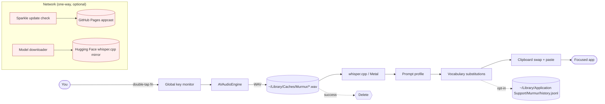

# Privacy

Read what Murmur promises about your data, what it writes to disk, and how to remove every trace.

## Promises

- **Zero network for transcription.** Audio never leaves your Mac.
- **No telemetry.** No usage pings, no crash analytics, no install beacons.
- **No transcript logging.** Logs contain timing, model name, error stacks — never the text of what you said.
- **Audio lifetime is one recording.** The temp WAV is deleted immediately after a successful transcription. On failure it's deleted within 60 s by the cleanup pass.
- **Mic is opened only on explicit recording.** No background streaming, no wake-word detector.
- **Accessibility is used only for the hotkey + paste.** Murmur does not inspect window contents, read other apps' UI trees, or proxy keystrokes for any purpose besides paste.
- **History is opt-in.** It's off by default; see [History](history.md).

## Data-flow diagram



The only traffic that ever leaves your Mac is in the pink box: the Sparkle update check (~1 KB XML) and the initial model download (Parakeet or Whisper, whichever engine you're using). **Transcription itself never touches the network for either engine** — Parakeet runs entirely on the Apple Neural Engine and whisper.cpp runs as a local subprocess. Nothing in the main transcription flow touches the network.

## Files Murmur writes

| Path | Purpose | Lifetime |
|---|---|---|
| `~/Library/Application Support/Murmur/config.json` | Settings, vocabulary, profiles | Until uninstall |
| `~/Library/Application Support/Murmur/Models/` | Whisper `.bin` + `.sha256` | Until you delete a model |
| `~/Library/Application Support/Murmur/history.jsonl` | Transcript archive (opt-in) | Honors your retention setting |
| `~/Library/Caches/Murmur/*.wav` | Temp audio | Deleted on successful transcription |
| `~/Library/Logs/Murmur/murmur-YYYY-MM-DD.log` | Timing, errors — never transcript text | Rotated daily; 7 days kept |

## Encryption at rest

Murmur relies on macOS FileVault for at-rest encryption. The app itself does not encrypt its own files — they live in your user library directory, protected by your account. If you sync `~/Library/Application Support/` via iCloud or a backup tool, those files travel with the rest of your data; encryption then depends on the sync service.

## Network policy

The only outbound endpoints Murmur ever contacts:

| Endpoint | Why | Frequency |
|---|---|---|
| `https://roshanshah11.github.io/murmur/appcast.xml` | Sparkle update check | Every 24 h (configurable) |
| `https://huggingface.co/ggerganov/whisper.cpp/resolve/main/...` | Whisper GGML model download | Only when you click **Download** |
| `https://huggingface.co/FluidInference/parakeet-tdt-0.6b-v3-coreml/...` | Parakeet model download (via FluidAudio SDK) | Only on first use, Apple Silicon only |

All three are HTTPS, all validate certificates, and none receives any data about you beyond the standard request headers. Once a model is downloaded, no further network calls occur for transcription — both engines run fully on-device.

If you want a hard guarantee, block Murmur at the firewall layer. Murmur will continue to work fully offline for transcription.

## Retention

- **Logs.** Daily rotation, 7-day retention by default. Adjust in **Settings → General → Diagnostic logs**.
- **History.** Off by default. When on, honors the retention setting (7 / 30 / 90 days / forever). See [History](history.md).
- **Audio.** Always deleted on success. Lingering temp files on crash are pruned at next launch.
- **Models.** Until you delete them.

## Remove all Murmur data

One-liner:

```bash
osascript -e 'quit app "Murmur"' ; \
  rm -rf "$HOME/Library/Application Support/Murmur" \
         "$HOME/Library/Caches/Murmur" \
         "$HOME/Library/Logs/Murmur" \
         "$HOME/Library/Preferences/com.murmur.app.plist" ; \
  tccutil reset Microphone com.murmur.app ; \
  tccutil reset Accessibility com.murmur.app
```

After that, drag **Murmur.app** out of `/Applications` (or `brew uninstall --cask murmur`).

## Auditing the source

Murmur is MIT-licensed. Every claim on this page is verifiable in the public repo:

- [github.com/roshanshah11/murmur](https://github.com/roshanshah11/murmur)
- Audit the network surface in `app/Sources/Murmur/Networking/` (Sparkle + model downloader only).
- Audit the audio surface in `app/Sources/Murmur/Audio/`.
- Audit logging in `app/Sources/Murmur/Logging/` — the `Logger` filters out transcript fields at compile time.

## Next

- [Architecture](architecture.md) for the module map.
- [Permissions](permissions.md) for the OS-level access list.
