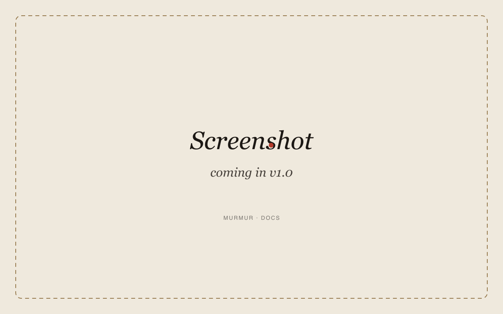

# Settings

Tour every tab in Murmur's Settings window. Open it from the menubar icon → **Settings…** or with `⌘,` when Murmur is frontmost.

The window has seven tabs:

1. [General](#general)
2. [Recording](#recording)
3. [Vocabulary](#vocabulary)
4. [Prompts](#prompts)
5. [Models](#models)
6. [Updates](#updates)
7. [About](#about)

---

## General

<!-- TODO: General tab screenshot -->

- **Launch at login.** Adds Murmur to your login items via `SMAppService`.
- **Menubar icon style.** Monochrome (default) or Filled. Both honor dark mode.
- **Notch overlay.** Show / hide / always-on-top of full-screen apps. See [Troubleshooting → notch invisible](troubleshooting.md#notch-overlay-invisible).
- **Pause music during recording.** On by default. Pauses Spotify and Apple Music when recording starts, resumes when it ends.
- **Confirmation sound.** Plays a short tick on successful paste.

## Recording

- **Hotkey.** Default `fn`+`fn`. Click to rebind to any modifier chord. See [FAQ → can I bind a different key](faq.md#different-key).
- **Hold-to-talk mode.** Off by default; enable to require the key held down for the duration of recording.
- **Auto-stop on silence.** Threshold (RMS) and trailing silence (seconds). Defaults: -38 dBFS, 1.5 s.
- **Maximum recording length.** Default 120 s. Bumps to 600 s if you change it.
- **Input device.** Defaults to the macOS system input. Override to force a specific mic (e.g. AirPods).

## Vocabulary

Edit substitutions Whisper applies after transcription. Full guide on the [Vocabulary](vocabulary.md) page.

- Add / edit / delete pairs (case-insensitive find, exact-case replace).
- Import / export JSON.
- Built-in "common AI/dev terms" preset (toggle on/off).

## Prompts

Pick the active prompt profile. Each profile applies a deterministic text-cleanup pass — no LLM call. See the full diff examples on [Prompts](prompts.md).

- **Raw.** Whisper output, unchanged.
- **Casual.** Capitalize first letter, normalize spacing, strip filler ("um", "uh").
- **Formal.** Casual rules + collapse contractions ("don't" → "do not"), spell out small numbers ("3" → "three").
- **Code.** Casual rules + lower-case everything outside backticks + collapse whitespace.

## Models

Download, switch, or delete Whisper models. Full sizing table on [Models](models.md).

- Active model is starred.
- Disk usage shown per model.
- SHA-256 verification on every download.
- Delete a model to free disk; Murmur will refuse to delete the active one without prompting.

## Updates

- **Check automatically.** Sparkle polls the appcast at `https://roshanshah11.github.io/murmur/appcast.xml` once every 24 h.
- **Check now.** Forces an immediate check.
- **Channel.** Stable (default) or Beta.
- **Skipped versions.** Reset the list.

The appcast is signed with an EdDSA key; updates without a valid signature are refused.

## About

- Version + build number.
- Whisper.cpp version + git SHA.
- Active model and size.
- License (MIT).
- Quick links to GitHub, the changelog, and these docs.

## Next

- [Turn on history](history.md) if you want a searchable archive of past dictations.
- [Pick the right Whisper model](models.md) for your machine.
